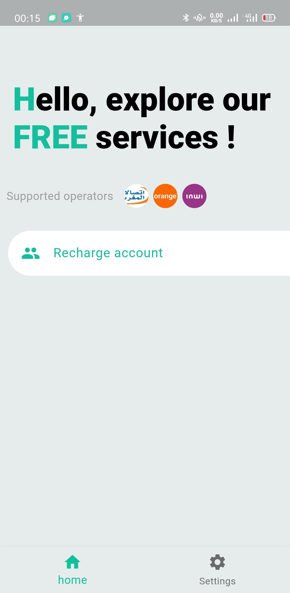
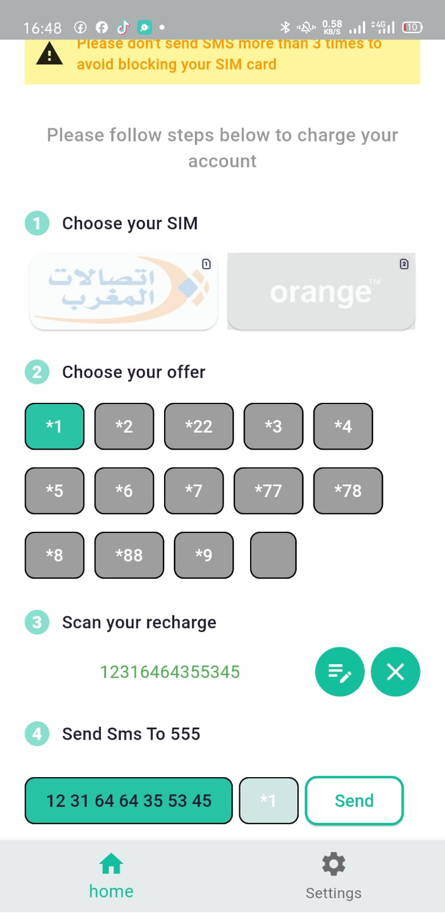
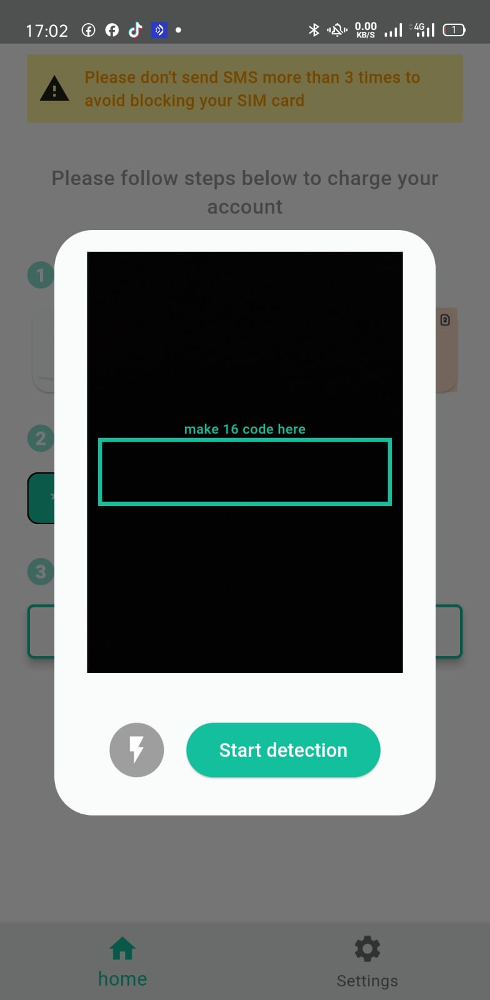
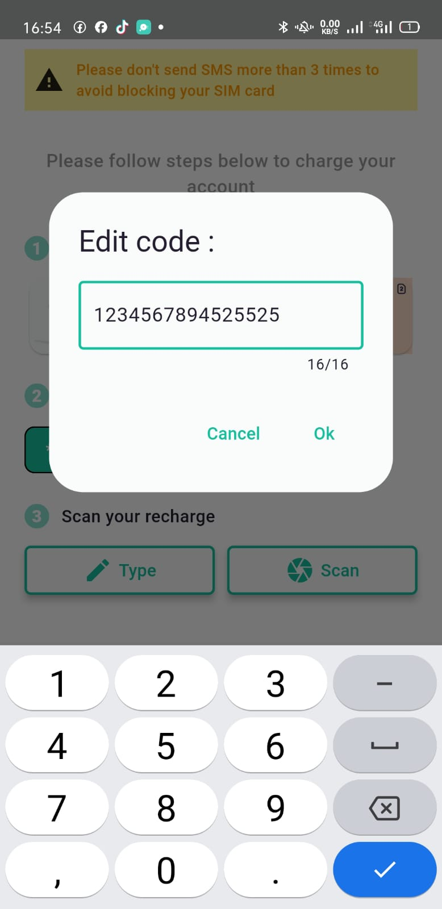

### recharge_by_scan

Recharge by Scan is an innovative Flutter application designed to simplify the process of recharging mobile accounts through scanning recharge cards. This project serves as a starting point for developers looking to build mobile applications with Flutter, providing a clean and functional template to get you started.

    
    
    
    

## Download

SIM manager can be downloaded from the links below:

<table>
    <thead>
        <tr>
            <th>OS</th>
            <th>Distribution</th>
            <th>Installation Guide</th>
            <th>CPU/Architecture</th>
            <th>Download Link</th>
        </tr>
    </thead>
    <tbody>
        <tr>
            <td>Android</td>
          <td>Play Store</td>
            <td></td>
            <td></td>
            <td><a href="https://play.google.com/store/apps/details?id=com.houssamelatmani.simmanager">Link</a></td>
        </tr>
    </tbody>
</table>

### Features

__User-Friendly Interface__: Intuitive navigation and a modern design make it easy for users to navigate the app.

__Recharge Card Scanning__: Users can effortlessly scan their recharge cards to quickly input the necessary information.

__Multi-Operator Support__: Supports various mobile operators, allowing users to choose their preferred provider.

__Offers and Promotions__: Provides users with information on available offers and promotions related to their selected operator.

### Getting Started

This project serves as a foundational template for Flutter applications. Whether you are a beginner or an experienced developer, you can use this project to jumpstart your Flutter development journey.

### Resources
To help you get started, here are some useful resources:

__Lab__: Write your first Flutter app: A guided introduction to Flutter development.
__Cookbook__: Useful Flutter samples: A collection of practical Flutter examples for various scenarios.
For more in-depth assistance with Flutter development, you can refer to the online documentation, which offers tutorials, samples, and comprehensive guidance on mobile development.

### Contributing
Contributions to this project are welcome! If you have suggestions for improvements or additional features, feel free to open an issue or submit a pull request.
